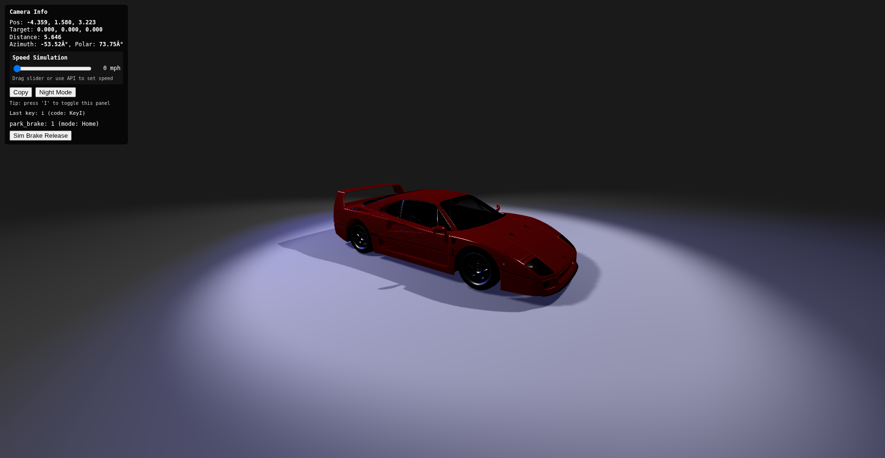
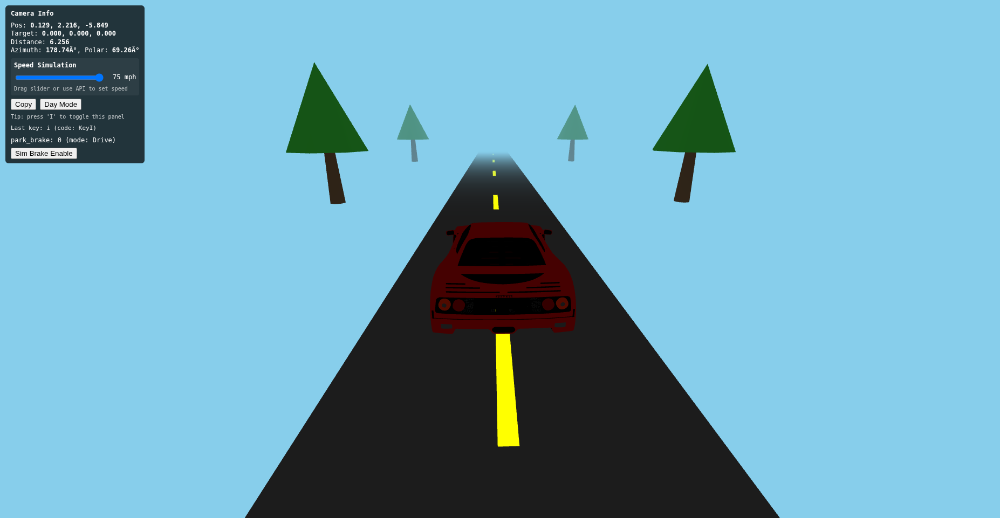
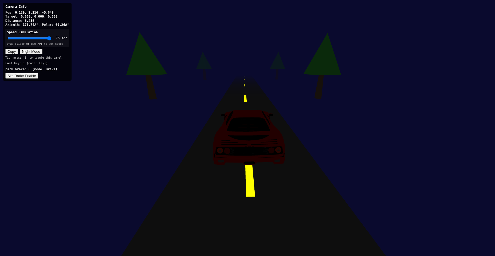

# car-visualizer

A small demo that shows a 3D car viewer using three.js and a GLTF model (Ferrari F40).

## Screenshots

### Home (Showroom) Mode

*The car is displayed in a dark showroom with dramatic spotlights, parking brake engaged*

### Drive Mode - Day

*Driving simulation with bright blue sky, animated road, and lane markings*

### Drive Mode - Night

*Night driving with dark sky and ambient lighting*

View online

- The demo is automatically deployed to GitHub Pages:
  - https://badgerloop-software.github.io/car-visualizer/
- Changes pushed/merged to the repository's main branch will be picked up by GitHub Pages (depending on the repo's pages settings) and appear online after the site build completes.

Run locally

- Serve the folder (from project root):
  - python3 -m http.server 8000
- Open http://127.0.0.1:8000/index.html in your browser.
- Note: the GLTF loader requires the files to be served over HTTP (don't open index.html with file://).

User controls & UI

- I — Toggle the Camera Info panel. Press once to open or close (works reliably regardless of element focus; click the viewer canvas if key events don't register).
- H — Jump to the saved "Home" preset (if present).
- C — Copy the current camera state to the clipboard (same as the "Copy" button in the panel).
- Mouse controls (OrbitControls):
  - Left-drag: rotate
  - Middle/Alt+drag: pan
  - Wheel: zoom
- After you stop interacting for ~1 second the camera will revert automatically to the current mode's preset (Home or Drive).
- The camera is clamped so you can't look under the floor plane (prevents pitching below ground).

Camera Info panel (press 'I')

- Shows:
  - Pos: camera position (x,y,z)
  - Target: orbit target (x,y,z)
  - Distance: distance from camera to target
  - Azimuth & Polar angles in degrees
  - **Speed Simulation**: Interactive slider (0-75 mph) to control animation speed in Drive mode
- Buttons:
  - Copy — copies camera state JSON to clipboard (position, target, distance, azimuthDeg, polarDeg)
  - Day Mode / Night Mode — toggles between day (bright blue sky) and night (dark sky) lighting
  - Sim Brake Enable/Release — toggles between Home and Drive camera views
- Default presets:
  - Home: `[-4.358857444267401, 1.5797084394163963, 3.222751650234066]`
  - Drive: `[0.12909591647276278, 2.215759854813773, -5.849405778042717]`
- Presets are stored in localStorage under the key: `cameraPresets` (the old `cameraHome` is migrated automatically if present).

Park brake simulation & signals

- There is a simulated brake button in the panel (label toggles between "Sim Brake Release" and "Sim Brake Enable").
- The viewer tracks a `park_brake` boolean state: 1 = engaged (Home), 0 = released (Drive).
- Edge behavior:
  - 1 -> 0 (released) triggers transition to the Drive preset (if present).
  - 0 -> 1 (engaged) triggers transition to the Home preset (if present).
- **Speed Control**: 
  - In Drive mode, the animation speed is controlled by the current speed setting (0-75 mph).
  - Speed can be set via the slider in the Camera Info panel, or programmatically via the API.
  - Speeds above 75 mph are automatically clamped to 75 mph for animation purposes.
  - At 0 mph, the road/environment animation stops (but wheels still rotate slowly).
  - At 50 mph, the animation runs at base speed.
  - At 75 mph, the animation runs at 1.5x base speed.
  - Wheel rotation speed scales proportionally with the set speed.
- Visual modes:
  - **Home (Showroom Mode)**: Dark background with spotlights, static environment, car displayed in showroom setting.
  - **Drive Mode**: Animated road moving toward the car, lane markings and trees moving to create illusion of travel. Animation speed controlled by speed setting.
    - **Day Mode**: Bright blue sky (#87ceeb), bright ambient lighting (0.6 intensity)
    - **Night Mode**: Dark night sky (#0a0a2e), dim ambient lighting (0.3 intensity)

Integration API (for parent application)

- window.cameraAPI
  - setPreset(name, data?) — Save a preset. `data` is optional; when omitted the current view is saved. `data` expects { position: [x,y,z], target: [x,y,z] }.
  - getPreset(name) — Get saved preset object or null.
  - listPresets() — Returns array of preset names.
  - goToPreset(name, duration?) — Smoothly move to the preset (duration in ms).
  - animateTo(targetPosition, targetTarget, duration) — Animate to given THREE.Vector3 positions.
  - receiveVehicleSignal(signalName, value) — Forwards signals into the viewer.
  - setDayMode(isDay) — Set day/night mode. Pass `true` for day, `false` for night.
  - getDayMode() — Returns current day/night mode state (true = day, false = night).
  - toggleDayNight() — Toggles between day and night mode, returns new state.
  - **setSpeed(mph)** — Set the current speed in mph (0-75, clamped at 75). Controls animation speed in Drive mode.
  - **getSpeed()** — Returns the current speed setting in mph.
  - **getAnimationSpeed()** — Returns the current animation speed multiplier (calculated from speed).

- Convenience globals:
  - window.receiveVehicleSignal(signalName, value)
    - e.g. window.receiveVehicleSignal('park_brake', 0) — triggers the park_brake handling.
    - e.g. window.receiveVehicleSignal('speed', 65) — sets speed to 65 mph.
    - Signal names containing 'speed' or 'velocity' are treated as speed signals (in mph).
  - window.setParkingBrakeState(value)
    - e.g. window.setParkingBrakeState(1)
  - **window.setCarSpeed(mph)**
    - e.g. window.setCarSpeed(55) — sets speed to 55 mph (clamped at 75).

Implementation notes

- Built with three.js r128 and uses `OrbitControls` + `GLTFLoader` for the model.
- **On page load/refresh, the camera ALWAYS starts in Home (showroom) mode** with the default preset position, ensuring a consistent starting view.
- Presets are stored in localStorage as `{ <name>: { position: [...], target: [...] } }`.
- The viewer auto-imports an example "Drive" preset (from demo data) on first run if no preset exists.
- Camera is constrained so it cannot go underneath the ground plane and polar angle is limited to prevent under-floor views.
- When user manipulates the camera, the viewer waits ~1s after interaction stops and then re-applies the current mode preset.

Troubleshooting

- Black screen: check DevTools console for errors and verify `ferrari_f40/scene.gltf` is present. If model fails to load a simple fallback car will be created.
- Keys not registering: click the render canvas to give it focus, then press keys.
- Copy to clipboard: uses the modern Clipboard API, with a textarea fallback if necessary.

License / Model credit

This work uses the Ferrari F40 model by Black Snow on Sketchfab, licensed under CC-BY-4.0. See `ferrari_f40/license.txt` for details.