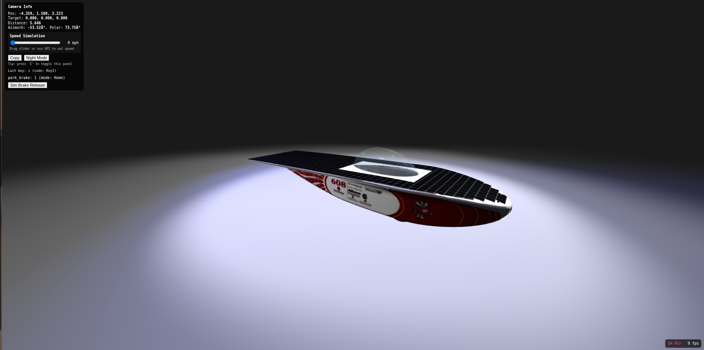
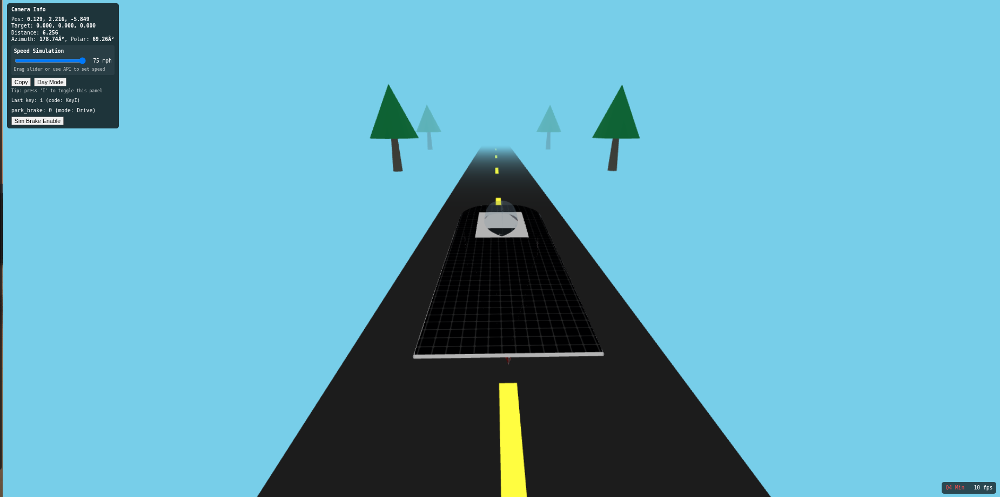
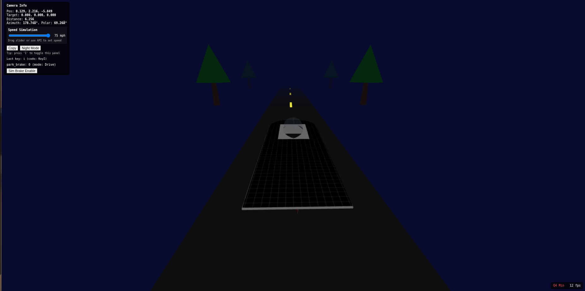

# car-visualizer

A Three.js web viewer for the BSR Sunburst vehicle model, with showroom and drive modes, camera presets, and adaptive performance scaling.

## Screenshots

### Home (Showroom) Mode


*The car is displayed in a dark showroom with dramatic spotlights, parking brake engaged*

### Drive Mode - Day


*Driving simulation with bright blue sky, animated road, and lane markings*

### Drive Mode - Night


*Night driving with dark sky and ambient lighting*

## View online

- The demo is deployed to GitHub Pages:
  - https://badgerloop-software.github.io/car-visualizer/
- Changes pushed/merged to the repository's main branch will appear online after the GitHub Pages build completes.

## Run locally

- Serve the project root (required for GLB loading):
  ```bash
  python3 -m http.server 8080
  ```
- Open http://127.0.0.1:8080/ in your browser.
- **Do not** open `index.html` via `file://` — the GLB loader and Draco decoder require HTTP.

## Model

- Primary asset: `sunburst-body/sunburst-body.glb` (exported from Blender; may use Draco mesh compression).
- On load failure, a simple box-car fallback is shown and an error is logged to the console.

## User controls & UI

- **I** — Toggle the Camera Info panel.
- **H** — Jump to the saved "Home" preset (if present).
- **C** — Copy the current camera state to the clipboard.
- **Mouse** (OrbitControls): left-drag rotate, middle/Alt+drag pan, wheel zoom.
- **Recenter View** — Appears at the top after you move the camera; click to return to the current mode's default view. Shows a **10s countdown** until auto-revert; the timer resets while you are still orbiting.
- After you stop interacting, the camera auto-reverts to the current mode preset after **10 seconds** (unless you recenter first).
- The camera cannot go below the floor plane.

### Camera Info panel (press `I`)

- Camera position, orbit target, distance, azimuth/polar angles.
- **Speed Simulation** slider (0–75 mph) for Drive mode animation.
- **Copy**, **Day Mode / Night Mode**, **Sim Brake Enable/Release**, **Recenter** (with countdown when active).
- Default presets (localStorage key `cameraPresets`):
  - **Home**: `[-4.358857444267401, 1.5797084394163963, 3.222751650234066]`
  - **Drive**: `[0.12909591647276278, 2.215759854813773, -5.849405778042717]`

### Performance HUD

- Bottom-right badge shows live FPS and quality level (Full → Min).
- Starting quality is chosen from GPU/RAM/CPU/screen hints.
- Quality steps down when FPS is low and steps back up when headroom returns (shadow resolution, pixel ratio, environment objects).

## Park brake & drive modes

- **Home (showroom)**: Dark background, spotlights, static floor; `park_brake` engaged.
- **Drive**: Animated road, lane markings, trees; speed-controlled wheel/road animation.
- **Day / Night**: Sky color and ambient lighting in Drive mode.
- `park_brake` 1→0 switches to Drive preset; 0→1 switches to Home.

## Integration API

### `window.cameraAPI`

| Method | Description |
|--------|-------------|
| `setPreset(name, data?)` | Save preset; `data` = `{ position: [x,y,z], target: [x,y,z] }` |
| `getPreset(name)` | Get preset or `null` |
| `listPresets()` | Preset names |
| `goToPreset(name, duration?)` | Animate to preset (ms) |
| `animateTo(targetPosition, targetTarget, duration)` | Animate to `THREE.Vector3` values |
| `receiveVehicleSignal(signalName, value)` | Handle vehicle signals |
| `setDayMode(isDay)` | Day/night in Drive mode |
| `getDayMode()` | Current day mode |
| `toggleDayNight()` | Toggle day/night |
| `setSpeed(mph)` | Speed 0–75 mph (clamped) |
| `getSpeed()` | Current speed |
| `getAnimationSpeed()` | Animation multiplier |

### Convenience globals

```javascript
window.setParkingBrakeState(1);           // engage → Home
window.setParkingBrakeState(0);           // release → Drive
window.setCarSpeed(55);                   // mph
window.receiveVehicleSignal('park_brake', 0);
window.receiveVehicleSignal('speed', 65);
```

## Implementation notes

- **Three.js r128** with `OrbitControls`, `GLTFLoader`, and `DRACOLoader` (for Draco-compressed GLBs).
- On load, the Sunburst model is scaled, centered on the scene origin, and materials are adjusted (opaque white aeroshell, glass windshield, solar panels, wrap decals).
- Page load always starts in **Home** mode with the default preset.
- Presets persist in `localStorage` under `cameraPresets`.

## Troubleshooting

- **Model won't load**: Serve over HTTP; check console for Draco/GLTF errors; confirm `sunburst-body/sunburst-body.glb` exists.
- **Black screen**: Open DevTools console; fallback box car appears if the GLB fails.
- **Keys not working**: Click the canvas to focus, then press `I` / `H` / `C`.
- **Low FPS**: The quality HUD should step down automatically; check console for `[perf] GPU renderer` and hardware score on load.